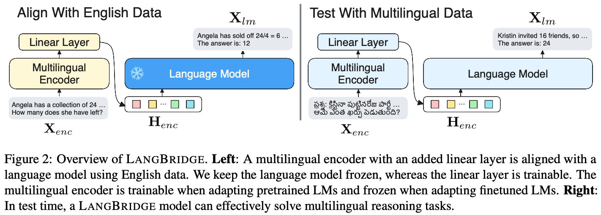

# LangBridge
[ACL 2024 Main] Repository for the paper "LangBridge: Multilingual Reasoning Without Multilingual Supervision".

### Links
- [Paper](https://aclanthology.org/2024.acl-long.405/)
- [Tweet (brief overview of the paper)](https://twitter.com/dongkeun_yoon/status/1749780849741160775)

# TL;DR
🤔LMs good at reasoning are mostly English-centric (MetaMath, Orca 2, etc).

😃Let’s adapt them to solve multilingual tasks. BUT without using multilingual data!

LangBridge “bridges” mT5 encoder and the target LM together while utilizing only English data. In test time, LangBridge models can solve multilingual reasoning tasks effectively.

<p align="center">
  
</p>


##  🤗Models
### Orca 2 (Instruction-tuned)
- [orca2-langbridge-9b](https://huggingface.co/kaist-ai/orca2-langbridge-9b)
- [orca2-langbridge-15b](https://huggingface.co/kaist-ai/orca2-langbridge-15b)
- [orca2-langbridge-20b](https://huggingface.co/kaist-ai/orca2-langbridge-20b)
### MetaMath (Instruction-tuned)
- [metamath-langbridge-9b](https://huggingface.co/kaist-ai/metamath-langbridge-9b)
- [metamath-langbridge-15b](https://huggingface.co/kaist-ai/metamath-langbridge-15b)
- [metamath-langbridge-20b](https://huggingface.co/kaist-ai/metamath-langbridge-20b)
### Code Llama (Not Instruction-tuned)
- [codellama-langbridge-9b](https://huggingface.co/kaist-ai/codellama-langbridge-9b)
- [codellama-langbridge-15b](https://huggingface.co/kaist-ai/codellama-langbridge-15b)
- [codellama-langbridge-20b](https://huggingface.co/kaist-ai/codellama-langbridge-20b)
### Llemma (Not Instruction-tuned)
- [llemma-langbridge-9b](https://huggingface.co/kaist-ai/llemma-langbrige-9b)
### Llama 2 (Not Instruction-tuned, Not Recommended)
- [llama2-langbridge-9b](https://huggingface.co/kaist-ai/llama2-langbridge-9b)
  
## Install
### Using the Models only
```
pip install -e .
```

### Replicating the evaluation from the paper
```
pip install -e .
pip install -e bigcode-evaluation-harness
pip install -e evaluation-harness
```

## Usage
### Quick usage example
#### Orca2-LangBridge
```python
from transformers import AutoTokenizer
from langbridge import LangBridgeModel

# our pretrained langbridge models all leverage this encoder tokenizer
enc_tokenizer = AutoTokenizer.from_pretrained('kaist-ai/langbridge_encoder_tokenizer') 
lm_tokenizer = AutoTokenizer.from_pretrained('kaist-ai/orca2-langbridge-9b')
model = LangBridgeModel.from_pretrained('kaist-ai/orca2-langbridge-9b').to('cuda')
orca_template = "<|im_start|>system\n{system_message}<|im_end|>\n<|im_start|>user\n{user_message}<|im_end|>\n<|im_start|>assistant"

# Use one of Orca's 16 system messages (Table 2) of https://arxiv.org/pdf/2306.02707
system_message1 = "You are an AI assistant. You will be given a task. You must generate a detailed and long answer." 
user_message1 = "한반도가 둘로 나뉘어진 이유가 뭐야?" # Why was the Korean Peninsula divided into two?

system_message2 = "You are a helpful assistant, who always provide explanation. Think like you are answering to a five year old."
user_message2 = "GPT-3 ఎందుకు అంత ప్రభావవంతంగా ఉందో వివరించండి." # Explain why GPT-3 is so influential.


prompt1 = orca_template.format(system_message=system_message1, user_message=user_message1)
prompt2 = orca_template.format(system_message=system_message2, user_message=user_message2)

output = model.generate_from_prefix(enc_tokenizer, lm_tokenizer, prompts=[prompt1, prompt2], max_length=300)
print(output[0])
print(output[1])
```

```
The division of Korea into North and South Korea can be traced back to the end of World War II in 1945. The Korean Peninsula was occupied by the United States and the Soviet Union, who were the main Allied powers in the region. The division was a result of political, economic, and social factors, as well as the ideological differences between the two superpowers.

1. Political Factors:

The political landscape of Korea was heavily influenced by the Cold War, which was a period of ideological and political rivalry between the United States and the Soviet Union. The United States was a capitalist democracy, while the Soviet Union was a communist state. The division of Korea was a direct result of the political rivalry between these two superpowers.

2. Economic Factors:

The Korean Peninsula was rich in natural resources, particularly coal, iron, and zinc. The United States and the Soviet Union sought to gain control over these resources to support their respective economies. The division of Korea allowed both superpowers to exploit these resources without having to share them with each other.

3. Social Factors:

The Korean people were deeply divided along political and social lines. The majority of the population in the north supported the communist ideology, while the majority in the south supported the capitalist ideology. The division of Korea was also influenced by (max length reached)
```
```
GPT-3 is a very powerful computer program that can understand and talk like a human. It's like a super smart friend who knows a lot about many things and can help you with your questions. It's so good because it has been trained on a lot of information, like a big library of books, and it can learn new things very quickly. This makes it very helpful for answering questions, writing stories, and even helping people with their work.
```

#### MetaMath-LangBridge
```python
from transformers import AutoTokenizer
from langbridge import LangBridgeModel

# our pretrained langbridge models all leverage this encoder tokenizer
enc_tokenizer = AutoTokenizer.from_pretrained('kaist-ai/langbridge_encoder_tokenizer') 
lm_tokenizer = AutoTokenizer.from_pretrained('kaist-ai/metamath-langbridge-9b')
model = LangBridgeModel.from_pretrained('kaist-ai/metamath-langbridge-9b').to('cuda')


metamath_template = (
    "Below is an instruction that describes a task. "
    "Write a response that appropriately completes the request.\n\n"
    "### Instruction:\n{instruction}\n\n### Response:\n"
    )
question = "문제: Jimmy는 Ethel이 가진 돈의 두배보다 2달러가 더 많습니다. Ethel이 8달러가 있다고하면, Jimmy는 얼마를 갖고 있나요?  정답: "
prompt = metamath_template.format(instruction=question)
output = model.generate_from_prefix(enc_tokenizer, lm_tokenizer, prompts=[prompt])
print(output)
```
```
If Ethel has 8 dollars, then Jimmy has 2 * 8 + 2 = 18 dollars.
Therefore, Jimmy has 18 dollars.
#### 18
The answer is: 18
```

#### Tips
1. Set the prefixes as if you were prompting the original LMs. For example, for Orca 2-langbridge use the Orca 2 template. For non-instruction-tuned models (Llama 2, Llemma, and Code Llama), you may need to use few-shot examples.
2. The encoder tokenizer is simply an [mT5 tokenizer with whitespace tokens](https://github.com/kaistAI/LangBridge/blob/16a781b1048dcc0089c986fd4bd63ab75c6a7d13/python_scripts/train_langbridge.py#L331). The reason for the added whitespaces is explained in section D.1 of the paper.

### Training Example
```
cd python_scripts
bash scripts/train_lb/metamath.sh
```
#### Tips
1. For optimal performance, keep `freeze_encoder=False` for pretrained LMs (trained on unlabeled corpora), and `freeze_encoder=True` for finetuned LMs (trained on labeled corpora). This is explained in section D.1 of the paper.
2. The training and validation data should have two columns: `input` and `output`. The `output` should be empty for unlabeled corpora. In this case pass `output_exists=False`, then the code will dynamically create the label(output) by splitting the input. The `output` shouldn't be empty for labeled corpora. In this case pass `output_exists=True`.
3. When training on `output_exists=False`, set `use_dynamic_enc_length=True`. See section 4.1. `use_dynamic_enc_length` flag won't have an effect when `output_exists=True`.

### Evaluation Example
```
cd python_scripts
bash scripts/eval/mgsm/metamath-lb-9b.sh
```


## Limitation
LangBridge mostly helps for low-resource languages. If the language model is already proficient in a certain language, LangBridge may lower performance in that language. Please refer to the paper for the detailed evaluation results.
